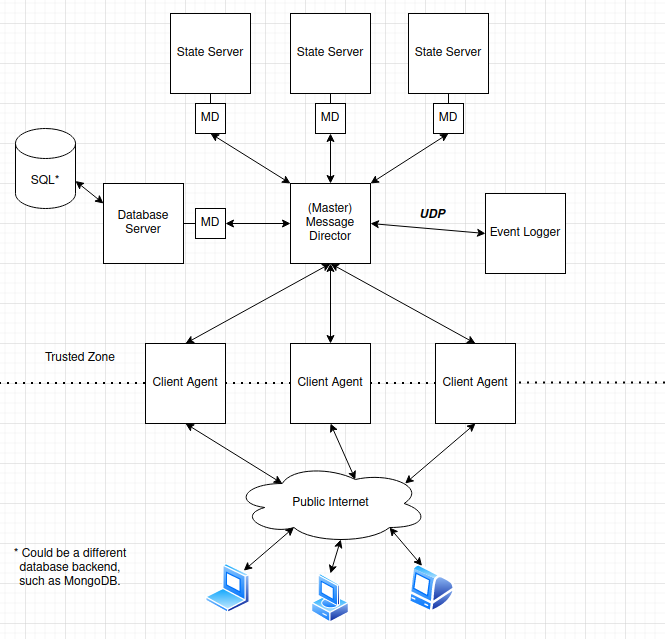

# 02 - Donet Services

The architecture of a Donet server cluster is made up of 6 different kinds of
services:

### **[CA] - Client Agent**

  The Client Agent service manages connections with **anonymous clients** that
  are connecting from outside of the internal server network. Clients do not
  directly communicate with the Donet cluster. Instead, the Client Agent relays
  client messages over to the network. This component provides two of the main
  features in a Donet server cluster, which is **security** and
  **network culling**. It reads the DC file(s) given to it and approves all
  messages from clients that conform to the communication 'contract' defined in
  the DC file. It also checks for other details, such as the clients' ownership
  over Distributed Objects and the visibility (or location) of Distributed
  Objects. The Client Agent acts as the border between the untrusted clients and
  the internal server network's 'safe zone'[^1].

[^1]: See the example diagram in the [02-Services](./02-Services.md) document.

### **[MD] - Message Director**

  The Message Director listens for messages from other services in a Donet
  server cluster, and **routes** them to other services based on the recipients
  in the message headers. A message is a blob of binary data sent over the
  network, with a maximum size of approximately **64 kilobytes**. The routing is
  performed by means of routing identifiers called **channels**, where a message
  contains any number of destination channels, and most messages include a
  source, or sender channel. Each service tells the Message Director which
  channels it would like to **subscribe** to, and receives messages sent to its
  subscribed channels.

### **[SS] - State Server**

  The State Server service is responsible of coordinating the short-term
  existence of Distributed Objects and their **states**. This component provides
  one of the main features in a Donet server cluster, which is
  **short-term persistence**. All Distributed Objects in a State Server exist in
  memory and are part of a graph hierarchy called the **visibility tree**. The
  State Server has data stored for each Distributed Object such as the class of
  the object, what its Distributed Object ID (DoId) is, and where it is located
  in the visibility tree. Other services in a Donet cluster may communicate with
  the State Server through a Message Director to **manipulate** and **query**
  Distributed Objects in the State Server's visibility tree.

### **[DB] - Database Server**

  The Database Server service is responsible for the long-term persistence of
  Distributed Object **fields** that are marked in the DC file with a
  **"db" keyword**, which tells the Database Server to store them on disk. It
  stores these fields in a **SQL database**, and can **update or query** the
  Distributed Object's field's value. The game/application developer does not
  need to handle Database transactions with the help of this service. The
  successor of this component is the Database State Server.

### **[DBSS] - Database State Server**

  The Database State Server (DBSS for short) is a kind of **hybrid** service of
  a State Server and a Database Server. This component is allows for other
  services in the cluster to manipulate Distributed Object fields that are
  **currently not loaded on a State Server**. The DBSS can also be configured to
  **listen to a range of DoId's** which it manages. If it sees a location update
  for an object in its range, it will query the object from the database and
  **convert it into a State Server object** in memory. For example, this is
  useful if you have an avatar object that is currently offline and stored on
  the database. If you would like to award a prize to the avatar while they're
  offline, the DBSS allows you to query and manipulate the object even though it
  is not currently needed in memory as the avatar is not actively 'present' in
  the State Server's visibility tree.

### **[EL] - Event Logger**

  The Event Logger listens to the Message Director for log messages that it
  should write to the disk. These log messages can be sent from AI processes,
  which are sent to a Message Director instance, which then routes it to the
  Event Logger. The Event Logger is a useful tool for providing instrumentation
  to your server cluster and allows the developer to analyze data in the game,
  depending on what the developer chooses to log. The Event Logger is the only
  service that uses the UDP protocol and [MessagePack](https://msgpack.org).

 

The following diagram shows an example of a Donet cluster:

Donet can be configured to serve as all these services under one daemon[^2],
which is handy for development on your local machine. For a production
environment, many instances of Donet can be running on different machines and
configured to serve as one service each. This configuration would be in a
**.toml file** that the Donet daemon would read on startup. The program will
look for a `daemon.toml` file by default, but you can specify a different file
name via argument. (See `donetd --help` for more information.)

[^2]: Note in the diagram that every service requires its own Message Director
service. All of the services' MDs make connections to the 'upstream MD', which
in this case would be directly to the master message director. In some
instances, such as in development environments, all services will make a direct
connection to the master message director.
