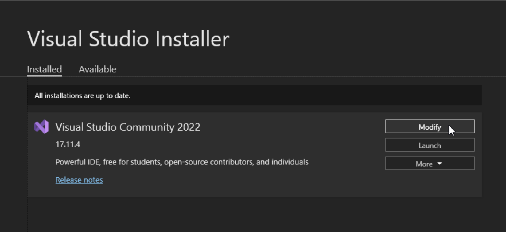
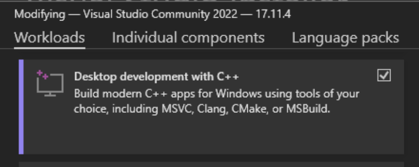
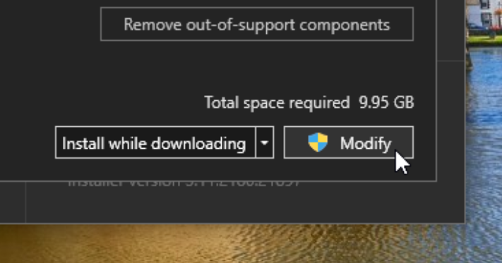
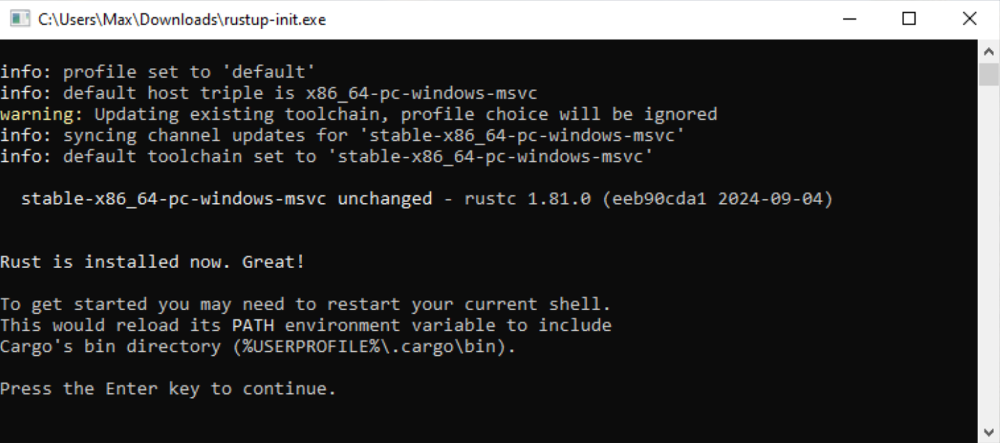
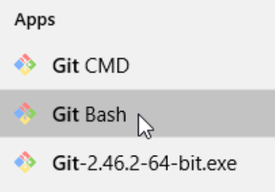

..
   This file is part of the Donet reference manual.

   Copyright (c) 2024 Max Rodriguez.

   Permission is granted to copy, distribute and/or modify this document
   under the terms of the GNU Free Documentation License, Version 1.3
   or any later version published by the Free Software Foundation;
   with no Invariant Sections, no Front-Cover Texts, and no Back-Cover Texts.
   A copy of the license is included in the section entitled "GNU
   Free Documentation License".

.. _building-windows:

Building on Windows with MSVC
=============================

Prerequisites
-------------

Microsoft Visual Studio
^^^^^^^^^^^^^^^^^^^^^^^

You will need Microsoft Visual Studio to build Donet on a Windows
machine. To download Visual Studio on your machine, visit the
following `download page`_.

.. _download page: https://visualstudio.microsoft.com/downloads/

If you did not already have Visual Studio installed on your PC,
follow the steps provided by the installer wizard. If you already
have it installed, open the Visual Studio Installer and modify your
installation.

          viewing the current visual studio installation entry.

In the modify installation view, scroll down and select the option
for "**Desktop development with C++**". This package is what includes
MSVC and other build tools in your Visual Studio installation.

          hovering over the "Desktop development with C++" package
          for the visual studio installation.

After selecting the package, modify your installation by clicking the
"Modify" button on the bottom-right corner of the installer window.

          hovering over the button to modify the installation.

Rust Toolchain
^^^^^^^^^^^^^^

Donet is written in Rust, so you will need the Rust compiler. The
Rust compiler (rustc) and other Rust utilities, such as Cargo, are
installed through Rustup. To install Rustup, see the
`Rustup download page`_.

.. _Rustup download page: https://www.rust-lang.org/tools/install

There is no installation wizard, rather, it is a command line tool.
It is similar to an installation wizard; Simply follow the
instructions given by the installer. If you see the following,
you have installed the Rust toolchain on your PC successfully.

          Rustup successfully.

.. important::

    Please verify that the active toolchain uses **msvc**.
    The host triple should end in ``-windows-msvc``.

Git Version Control System
^^^^^^^^^^^^^^^^^^^^^^^^^^

Next, you will need to install `Git for Windows`_ on your system.
The installation for Git is straight forward, you can follow the
installer wizard with the recommended settings. Git for Windows
also provides a MinGW_ environment for development, which is
**required** to build Donet.

.. _Git for Windows: https://git-scm.com/downloads/win
.. _MinGW: https://en.wikipedia.org/wiki/MinGW

Meson Build System
^^^^^^^^^^^^^^^^^^

You will also need the Meson_ build system to build Donet from
source. Meson is usually installed as a Python PIP package, but the
Meson project also provides an `MSI installer wizard`_ for new users.
This also comes with an embedded copy of Python.

.. _MSI installer wizard: https://mesonbuild.com/Getting-meson.html#installing-meson-and-ninja-with-the-msi-installer

Getting a copy of the code
--------------------------

The Donet software repository is hosted on GitLab, and mirrored to
GitHub. You can get a copy of the repository on your local machine
by using Git to clone the repo.

As mentioned above, you will need a MinGW environment to build Donet.
Therefore, the following instructions will use the **Git Bash** tool
which is included with Git for Windows.

In the terminal prompt, clone the repo with the following command:

.. code-block:: shell

    git clone https://gitlab.com/donet-server/donet.git

Building from source
--------------------

The quickest way to **build for debug** is to do the following:

Run the following Meson commands under the project directory:

.. code-block:: shell

    meson setup build -Dprofile=debug
    meson compile -C build

.. note::

    The instructions above will compile the Donet project and its
    crates without optimizations and includes more verbose logging.
    To build Donet for **release**, simply remove
    ``-Dprofile=debug``.

.. warning::

    It is important that you are using Git Bash, as it launches
    with a MinGW environment provided by your Git installation.
    If you try to build Donet without this environment, you will
    receive the following error upon configuring the build:

    .. image:: windows_no_mingw.png
        :scale: 40%
        :alt: A screenshot of the command prompt with the
              following Meson output, "ERROR: Assert failed:
              Windows detected, but no GNU core utils found.
              A MinGW environment, or equivalent, is required
              to build Donet."

If Donet compiles with no errors, you should have the built
executable in your Meson build directory, under the ``donet``
subdirectory.

If you are working on a contribution to either the Donet daemon or
libdonet, please run code linting and unit testing before pushing:

.. code-block:: shell

    meson compile linting -C build
    meson compile tests -C build

These checks should go over all source files in the ``donet/`` and
``libdonet/`` source directories.

.. tip::

    If you would like to build only certain Donet services into the
    output binary, you can use the available Meson options to trigger
    feature flags in the Crate:

    .. code-block:: shell

        meson setup build -Dbuild_state_server=true

    If any ``build_*`` Meson options are passed,
    ``--no-default-features`` is passed to cargo build, which disables
    building all services. Only the service(s) that you explicitly
    request to be built will be activated via `feature flags`_.

.. _Meson: https://mesonbuild.com/
.. _Cargo: https://doc.rust-lang.org/cargo/
.. _feature flags: https://doc.rust-lang.org/cargo/reference/features.html
