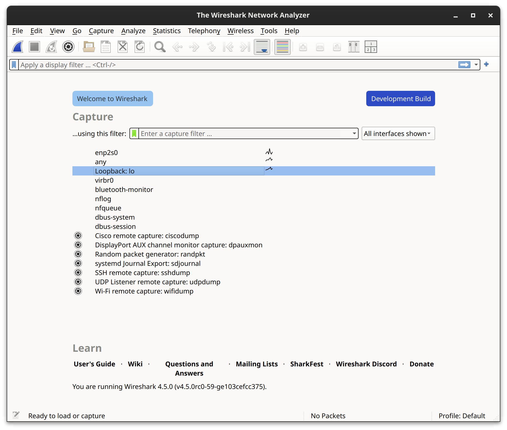
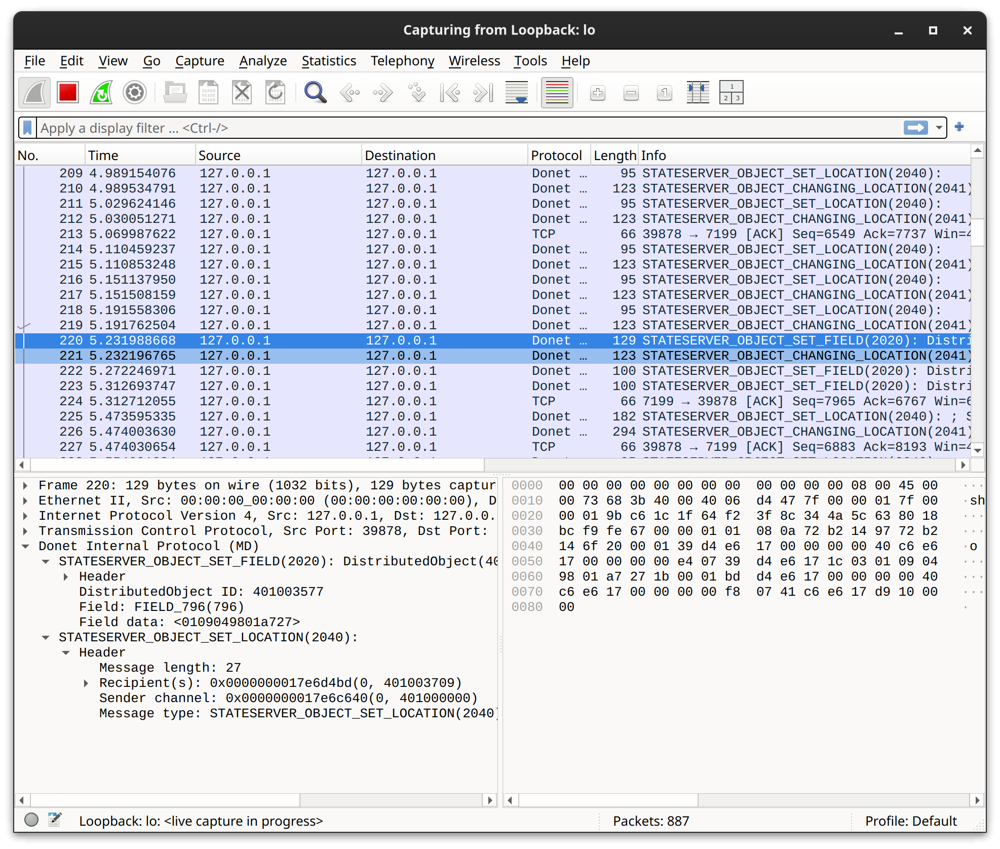

..
   This file is part of the Donet reference manual.

   Copyright (c) 2024 Max Rodriguez.

   Permission is granted to copy, distribute and/or modify this document
   under the terms of the GNU Free Documentation License, Version 1.3
   or any later version published by the Free Software Foundation;
   with no Invariant Sections, no Front-Cover Texts, and no Back-Cover Texts.
   A copy of the license is included in the section entitled "GNU
   Free Documentation License".

.. _debugging:

Debugging
=========

Just as you are able to build and develop Donet using only free and
open source software, you can also troubleshoot Donet with only free
and open source software. This section documents the various
debugging methods and utilities you can use to troubleshoot Donet,
as a developer and a user.

Daemon Logs
-----------

The Donet daemon periodically outputs log messages for debugging
purposes. A typical log message might look like this::

    [2024-10-21 23:12:12] INFO: donetd::network::tcp: Opened new TCP listening socket at 127.0.0.1:7199.

The log message format is very familiar to Astron_'s logging format.
The first part of the message, ``[2024-10-21 23:12:12]``, is the
timestamp of when the message was logged. The second part, ``INFO``,
is the severity level of the log event. The third part,
``donetd::network::tcp``, is the name of the module that generated
the log message. The severity levels are, in decreasing order:
error, warn, info, debug, and trace.

You can configure Donet's log level via its TOML configuration file:

.. code-block:: toml

    [daemon]
    log_level = "info" # default: "info"

.. _Astron: https://github.com/astron/astron

Network Analysis
----------------

While developing for Donet, or developing an application that uses
Donet, you will find it extremely useful to be able to profile the
network activity between your application(s) and the Donet cluster.
You can use the free and open source Wireshark_ program to intercept
network messages from Donet.

In the Donet repository, under the directory ``tools/wireshark``, you
can find a `Lua script`_ that serves as a Wireshark plugin for
dissecting network packets that use the Donet protocol. To install
the lua plugin on your local machine's Wireshark installation, read
the Wireshark `plugin installation guide`_.

In a nutshell, you simply need to copy the lua file over to a certain
directory that Wireshark reads. This depends on what operating system
your machine runs.

On **Windows**, copy the lua file to: ``%APPDATA%\Wireshark\plugins``.

On **Unix-like systems**, such as GNU/Linux, copy the lua file to:
``~/.local/lib/wireshark/plugins``.

On **MacOS**, the directory is ``%APPDIR%/Contents/PlugIns/wireshark``
if Wireshark is installed as an application bundle, otherwise the
plugin directory is located at ``INSTALLDIR/lib/wireshark/plugins``.

.. caution::

    On Unix-like systems, avoid installing Wireshark as a flatpak as
    this version of Wireshark does not support capturing data. See
    `Wireshark flatpak repo issue 4`_ for more details.

    If your network interfaces are not being enumerated by a system
    installation of Wireshark, you may need to run the following
    command after installation:

    .. code-block:: shell

        $ sudo usermod -a -G wireshark $USER

.. _Wireshark flatpak repo issue 4: https://github.com/flathub/org.wireshark.Wireshark/issues/4#issuecomment-1341638375

The following image is what the Wireshark graphical main menu should
look like if set up correctly for capturing network packets. Your
machine's network interfaces, such as Ethernet, WI-FI, loopback, etc.
should be listed in this menu. Interfaces may differ across machines,
but **loopback (lo)** should be there on all systems. This is the
network interface that local development applications using Donet
will communicate through. The reserved IPv4 address for loopback is
**127.0.0.1**.

After selecting the **loopback** interface, Wireshark should start
to intercept network packets being sent to that interface. The
following image is an example of Wireshark intercepting network
messages that are using the Donet protocol. If you select a packet to
inspect, the Lua plugin should dissect the message for you and show
details in the bottom-left panel, such as sender/recepients and
message type fields.

.. _Wireshark: https://www.wireshark.org
.. _Lua script: https://gitlab.com/donet-server/donet/-/blob/master/tools/wireshark/donet_protocol.lua?ref_type=heads
.. _plugin installation guide: https://www.wireshark.org/docs/wsug_html_chunked/ChPluginFolders.html

Debugging with GDB
------------------

If you are making modifications to the Donet source, it is crucial to
use a debugger program to properly troubleshoot and resolve bugs
during development. It is recommended to use GDB_ as your debugger.
If you are unfamiliar with the GNU project debugger (GDB), you can
read "`Debugging with GDB`_".

.. _GDB: https://sourceware.org/gdb
.. _Debugging with GDB: https://sourceware.org/gdb/current/onlinedocs/gdb
