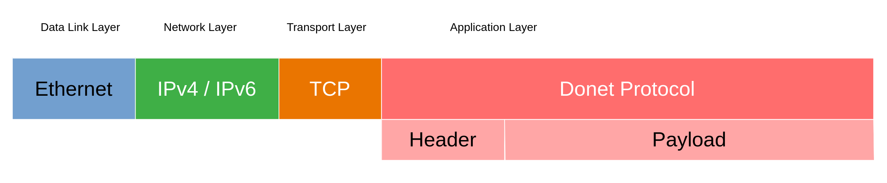

.. _encapsulation:

Payload Encapsulation
=====================

The encapsulation of Donet messages varies depending on what
Donet protocol is being used. As mentioned in the previous
page, there is an **internal** protocol and a **client**
protocol. They both are practically the same format, but with
different headers. Both protocols are encapsulated in TCP_.

Client Protocol
---------------

For the client protocol, the headers are as follows:

.. code-block:: cpp

    uint16 length;
    uint16 msgtype;
    ... // The message may have a payload

All multi-byte types are to be sent in little-endian_ order.

The "length" tag represents the length of the message, in bytes,
**NOT** counting itself.

This protocol requires a handshake process once the TCP connection
has been established. See the :ref:`client` for more information.

Internal Protocol
-----------------

For the internal protocol, the headers are as follows:

.. code-block:: cpp

    uint16 length;
    uint8 recipient_count;
    uint64 recipients[recipient_count];
    uint64 sender;
    uint16 msgtype;
    ... // The message may have a payload

The following is an example:

.. code-block:: cpp

    1a 00                   // Length: count of the following bytes
    01                      // One recipient channel
    d2 04 00 00 00 00 00 00 // Recipient channel ID 1234
    e1 10 00 00 00 00 00 00 // Sender channel ID 4321
    39 05                   // Message type ID 1337.
    05 00 48 45 4c 4c 4f    /* Payload for the message; in this
                               example, the string "HELLO" --
                               strings are prefixed with a length
                               field of their own, hence the 05 00 */

.. _TCP: https://en.wikipedia.org/wiki/Transmission_Control_Protocol
.. _little-endian: https://en.wikipedia.org/wiki/Endianness
